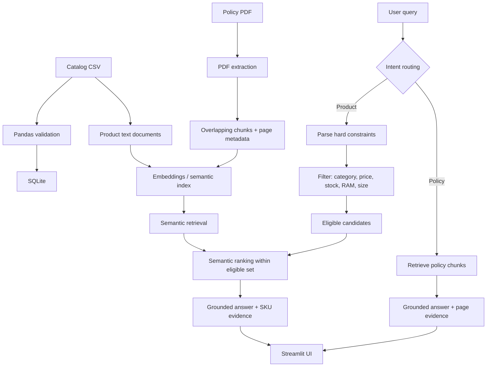

# ShopSense architecture

```mermaid
flowchart TD
 A[Catalog CSV] --> B[Pandas validation] --> C[SQLite]
 A --> D[Product text documents]
 E[Policy PDF] --> F[PDF extraction] --> G[Overlapping chunks + page metadata]
 D --> H[Embeddings / semantic index]
 G --> H
 Q[User query] --> I{Intent routing}
 I -->|Product| J[Parse hard constraints]
 J --> K[Filter: category, price, stock, RAM, size]
 H --> L[Semantic retrieval]
 K --> M[Eligible candidates]
 L --> N[Semantic ranking within eligible set]
 M --> N
 I -->|Policy| O[Retrieve policy chunks]
 N --> P[Grounded answer + SKU evidence]
 O --> R[Grounded answer + page evidence]
 P --> S[Streamlit UI]
 R --> S
```

Hard constraints are deterministic and always precede product ranking. Semantic similarity cannot override price, stock or specification filters.
